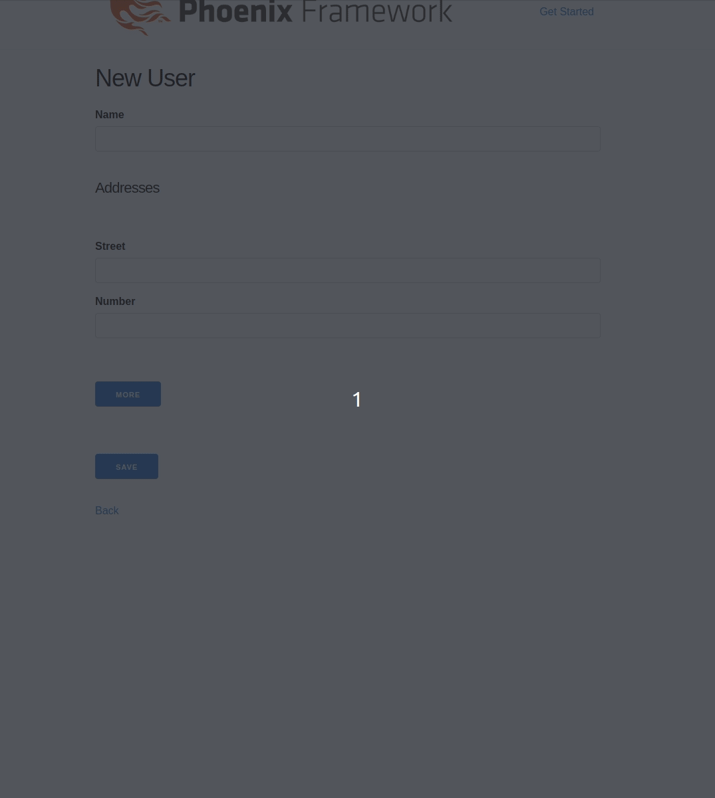

# Dynamic Nested 


 
Add dynamic support to add and remove nested associations generated by `Phoenix.HTML.inputs_for`.



## Examples

In order to get it working, the following attributes must be added in the markup:

```
[dynamic-nested]                 - to active this component.
[dynamic-nested-index=${index}]  - to get nested association.
[dynamic-nested-add]             - to add nested.
[dynamic-nested-remove]          - to remove nested.
```

```HTML
<div dynamic-nested>
 <%= inputs_for @f, :categories, [skip_hidden: true], fn c -> %>
   <%= content_tag :div, dynamic_nested_index: c.index do %>
     # PS: generate hidden fields inside rows group to handle them easily.
     = for {key, value} <- row.hidden do
       = hidden_input c, key, value: value, dynamic_nested_field_id: true
     <%= text_input c, :name %>
     <button type="button" dynamic-nested-remove>Remove</button>
   <% end %>
 <% end %>
</div>

<button type="button" dynamic-nested-add>Add</button>
```

Also, make sure to initialize this script after importing it on your application.

```JS
import DynamicNested from 'dynamic_nested'

document.querySelectorAll('[dynamic-nested]').forEach(element => DynamicNested(element))
```

It supports the following callbacks:

* beforeClone  - You might want to do something before cloning the element.
* afterAdd     - You might want to do something after adding the new element.
* afterRemove  - You might want to do something after removing the element.

```JS
const beforeClone = (element) => { ... }
const afterAdd    = (element, newElement) => { ... }
const afterRemove = (elements) => { ... }

document
  .querySelectorAll('[dynamic-nested]')
  .forEach(element => DynamicNested(element, { beforeClone, afterAdd, afterRemove }))
```

Everytime a User adds a new row, it is going to generate a new index for that row incrementing
+1 from the last row on the page. As soon as an User removes a row, all indexes will be updated
accordingly to reflect their position on the page.

## Instalattion
```
npm install --save dynamic_nested
```

## Know caveats

* It must contains at least one nested markup rendered on the page since `DinamicNested` will
 use it as a template to clone.
* You must be using the last version of `Phoenix.HTML` that supports `skip_hidden` fields.
